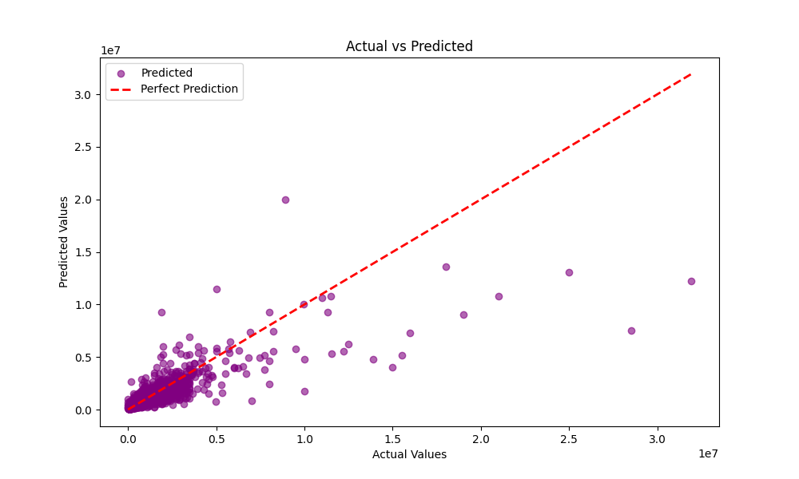
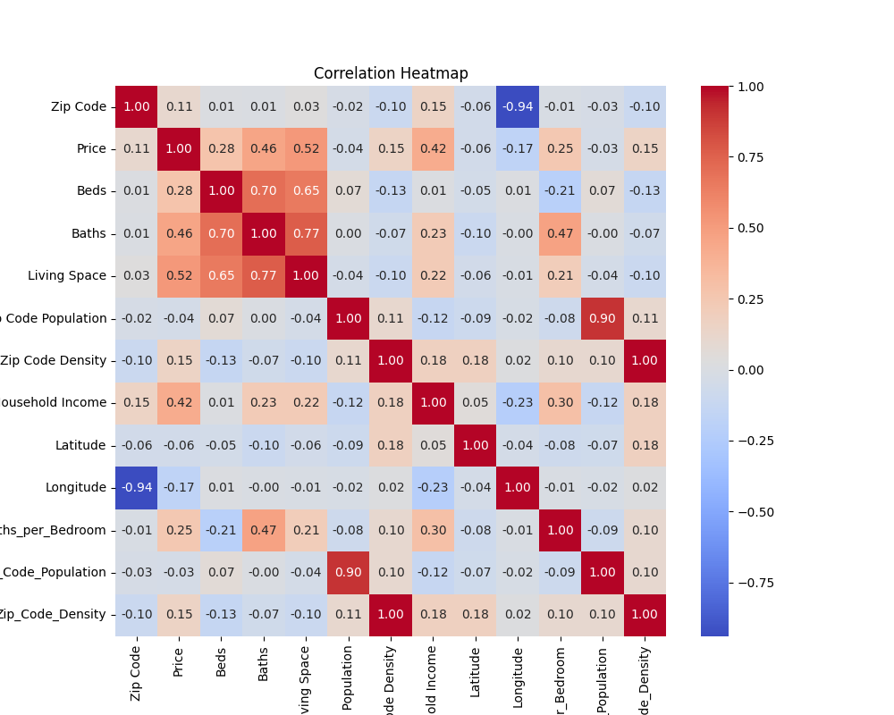
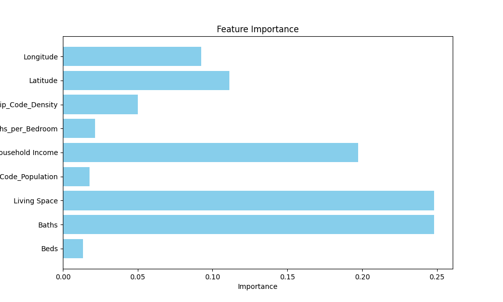
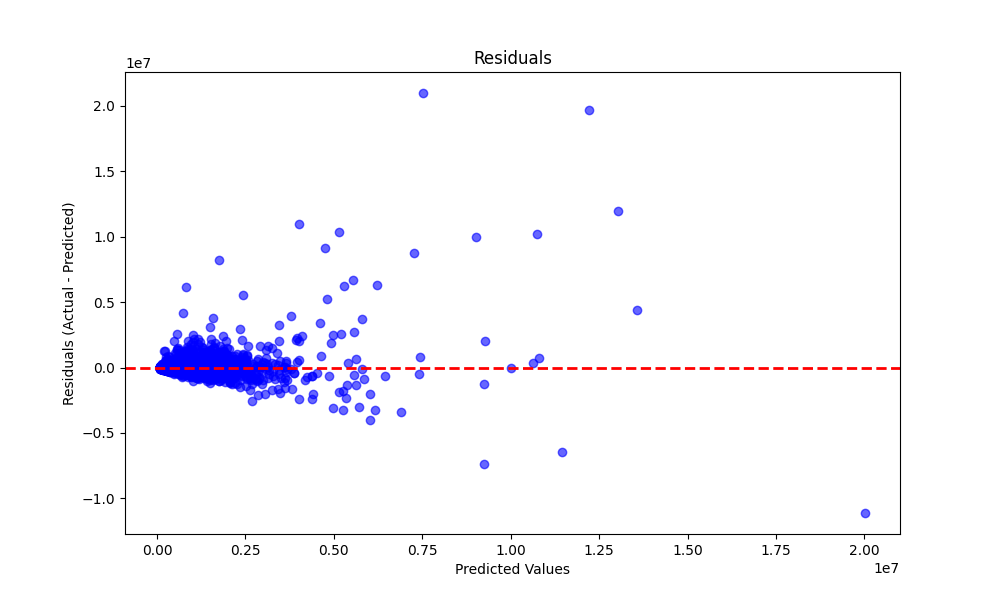

# House Rate Predictor & Grade Predictor

Welcome to the **House Rate Predictor & Grade Predictor** repository! This project combines two machine learning applications into one repository:

1. **House Rate Predictor**: A sophisticated model to predict house prices based on various housing and demographic features.
2. **Grade Predictor**: A tool to predict student grades based on key academic and demographic data.

Both applications showcase end-to-end machine learning pipelines, starting from data preprocessing to model deployment, utilizing advanced machine learning techniques and robust web deployment strategies.

---

## **Table of Contents**

- [Introduction](#introduction)
- [Project Features](#project-features)
- [Dataset Description](#dataset-description)
- [Technical Workflow](#technical-workflow)
  - [Data Preprocessing](#data-preprocessing)
  - [Feature Engineering](#feature-engineering)
  - [Model Training](#model-training)
  - [Post-Training Enhancements](#post-training-enhancements)
  - [Web Deployment](#web-deployment)
- [Architecture](#architecture)
- [Installation](#installation)
- [Usage](#usage)
- [Results and Evaluation](#results-and-evaluation)
- [Future Enhancements](#future-enhancements)
- [Contributing](#contributing)
- [License](#license)

---

## **Introduction**

This repository demonstrates the application of machine learning to solve real-world problems:

- **House Rate Predictor** uses historical housing data and demographic details to provide accurate house price predictions.
- **Grade Predictor** leverages academic and demographic inputs to estimate student performance metrics.

Both applications highlight the integration of machine learning with Flask-based APIs for seamless interaction and deployment.

---

## **Project Features**

### **House Rate Predictor**
- Accepts inputs such as:
  - Number of bedrooms and bathrooms
  - Living space in square feet
  - Zip code population and density
  - Median household income
  - Geographical latitude and longitude
- Predicts house prices with high accuracy using Random Forest Regressor.
- Includes advanced feature engineering for better model performance.

### **Grade Predictor**
- Accepts inputs such as:
  - Hours studied
  - Participation in extracurricular activities
  - Past academic performance
  - Demographic data (if applicable)
- Predicts grades using a regression-based approach.
- Implements preprocessing pipelines for feature scaling and encoding.

### Additional Features
- End-to-end ML pipeline design (preprocessing, feature engineering, training, and deployment).
- Flask-based RESTful APIs for real-time predictions.
- Fully styled HTML-based web interface for user interaction.
- Integration with GitHub and Render for seamless deployment.

---

## **Dataset Description**

### **House Rate Predictor Dataset**
- **Source**: American Housing Data (simulated or real-world).
- **Features**:
  - Beds, Baths, Living Space
  - Zip Code Population and Density
  - Median Household Income
  - Latitude and Longitude
  - Derived features: `Baths_per_Bedroom`, `Log_Zip_Code_Population`
- **Target**: House Price

### **Grade Predictor Dataset**
- **Source**: Academic records (simulated or real-world).
- **Features**:
  - Hours Studied, Attendance
  - Participation in Extracurricular Activities
  - Prior GPA or Grades
- **Target**: Predicted Grade

---

## **Technical Workflow**

### **1. Data Preprocessing**
- **Handling Missing Values**:
  - Numerical columns: Imputed using median values.
  - Categorical columns: Handled using OneHotEncoding.
- **Removing Duplicates**: Ensured unique rows in datasets.
- **Feature Scaling**: Applied StandardScaler to normalize numerical data.

### **2. Feature Engineering**
- **House Rate Predictor**:
  - Created new features like:
    - `Baths_per_Bedroom` = Baths / (Beds + 1e-6)
    - `Log_Zip_Code_Population` = log(Zip Code Population + 1)
  - Retained essential features and removed redundant ones.
- **Grade Predictor**:
  - Standardized numerical features (e.g., Hours Studied).
  - Encoded categorical features (e.g., participation in extracurricular activities).

### **3. Model Training**
- **House Rate Predictor**:
  - Random Forest Regressor with:
    - 100 estimators
    - Max depth: 10
    - Random state: 42
- **Grade Predictor**:
  - Linear Regression as a baseline model.

### **4. Post-Training Enhancements**
- **Error Analysis**:
  - Evaluated Mean Squared Error (MSE) to refine hyperparameters.
  - Visualized actual vs. predicted values using scatter plots.
- **Model Serialization**:
  - Saved trained models using `joblib` for deployment.

### **5. Web Deployment**
- Built REST APIs using Flask:
  - **/predict (POST)**: Accepts input data as JSON and returns predictions.
- Styled web pages using HTML and CSS for user-friendly input forms.
- Deployed on Render with production-ready configurations using Gunicorn.

---

## **Architecture**

```
📂 Project Root
├── Big_House_Predictor/
│   ├── templates/
│   │   └── index.html (User Interface)
│   ├── house_price_model_optimized.pkl (Serialized Model)
│   ├── American_Housing_Data.csv (Dataset)
│   ├── main.py (Flask Application)
├── requirements.txt (Dependencies)
├── Procfile (Deployment Configuration)
├── README.md (Documentation)
```

---

## **Installation**

### Prerequisites
- Python 3.8+
- Pip package manager
- Render or any hosting service for deployment

### Steps
1. Clone the repository:
   ```bash
   git clone https://github.com/CodeWithInferno/House-Rate-Predictor-ML-model.git
   ```

2. Navigate to the project directory:
   ```bash
   cd House-Rate-Predictor-ML-model
   ```

3. Install dependencies:
   ```bash
   pip install -r requirements.txt
   ```

4. Run the Flask app locally:
   ```bash
   python main.py
   ```

5. Access the application at `http://127.0.0.1:5000`.

---

## **Usage**

1. **House Rate Predictor**:
   - Input housing features in the form on the webpage.
   - Click "Predict" to get the estimated house price.

2. **Grade Predictor**:
   - Input academic and demographic features.
   - Click "Predict" to get the estimated grade.

---

## **Results and Evaluation**

### **House Rate Predictor**
- **Model Performance**:
  - Mean Squared Error (MSE): ~Low value (indicates good performance).
- **Visualization**:
  - Actual vs. Predicted Prices scatter plot to show model accuracy.

### **Grade Predictor**
- **Model Performance**:
  - High correlation between predicted and actual grades.
- **Error Analysis**:
  - Visualized prediction residuals for insights.

---

## **Future Enhancements**

- Add advanced algorithms like Gradient Boosting for better accuracy.
- Include additional features like neighborhood crime rates for house prediction.
- Develop a comprehensive dashboard for visualizing model predictions and insights.
- Support for multi-user input sessions and saving results in the database.

---

## **Contributing**

We welcome contributions from the community! If you’d like to contribute:
1. Fork the repository.
2. Create a feature branch:
   ```bash
   git checkout -b feature-name
   ```
3. Commit your changes:
   ```bash
   git commit -m "Add new feature"
   ```
4. Push to your branch:
   ```bash
   git push origin feature-name
   ```
5. Create a pull request.

---

## Visualizations

### 1. Actual vs Predicted Prices


This plot compares the actual house prices with the predicted prices, showcasing the model's performance.

---

### 2. Correlation Heatmap


The heatmap illustrates the correlation between various features in the dataset, helping identify key predictors of house prices.

---

### 3. Feature Importance


This bar chart highlights the importance of each feature used in the model, ranked by its contribution to predictions.

---

### 4. Residuals Plot


The residuals plot shows the differences between actual and predicted prices, helping assess the model's accuracy.


## **License**

This project is licensed under the MIT License. See the `LICENSE` file for details.

